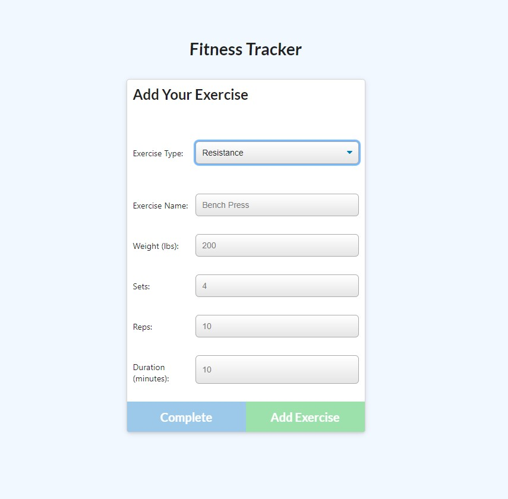

# Fitness Tracker

A daily exercise tracker app. Allows user to add new workouts or update existing workouts with type of exercise, weight, reps, etc.

Technologies used:

- Express
- Mongo DB
- Node
- Mongoose

Screenshot of deployed site:

Site deployed on heroku at: https://dashboard.heroku.com/apps/dabestfitness
